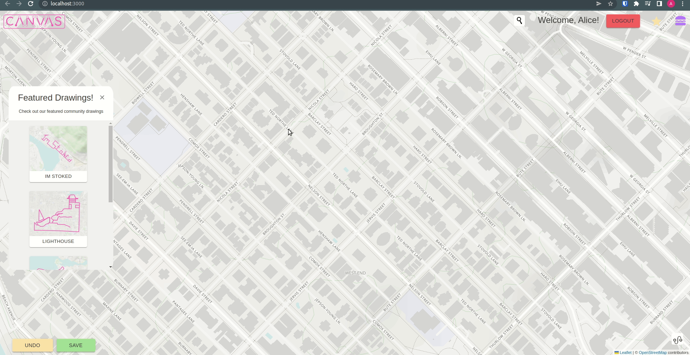
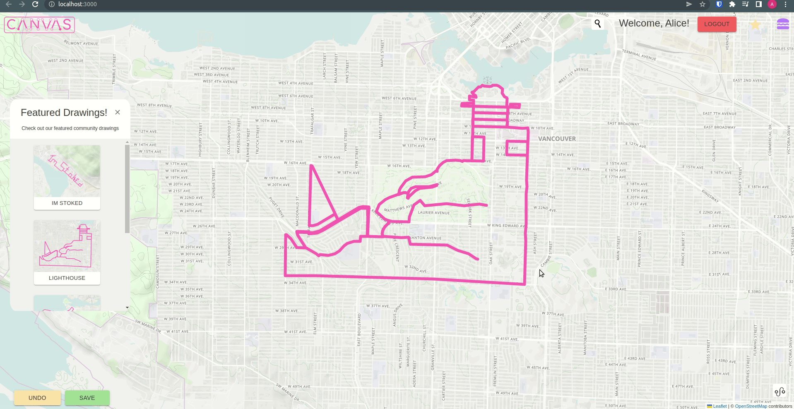

# Canvas

### Project Description

An online mapping tool that allows users to bring there artistic flourish to the streets of there local neighbourhood. Users can draw routes using our application in whatever shape or design they like. Then following directions they can physically create their master pieces.

### Project Features

- Upon arrival to the site, a user has access to an interactive map of the world.

- A user can use the search bar to navigate to a specific area of their choosing

- A Featured Drawings module on the lef hand side offers up a host of differetn example drawings made by members of canvas community.

- If a user logs in they gain access to their drawing library with options to view, share or delete any drawing.
- Once logged in a user can create a drawing by clicking points on the screen, once finsihed a drawing can be saved and added to a users drawing library.

- A user can toggle the directions button at any time to see turn by turn directions for the currently loaded drawing.

## Screenshots:

#### CREATE A DRAWING


#### FEATURED DRAWINGS


#### DRAWING LIBRARY


#### DIRECTIONS 


## Run Locally:

Clone the front end of the project

```bash
  git clone https://github.com/AidanYee/Canvas
```

Go to the project directory

```bash
  cd Canvas
```

Install dependencies

```bash
  npm install
```

Clone the back-end of the project

```bash
  git clone https://github.com/AidanYee/canvas-api-
```

Go to the project directory

```bash
  cd canvas-api-
```

Install dependencies

```bash
  npm install
```

## Register for the Following Accounts and API Keys:

### Maptiler Mapping Platform:

##### Sign up for a free Map Tiler account and create a new API key:

Sign Up:
[Map Tiler Sign Up](https://www.maptiler.com/)

### Grpah Hopper Routing Engine:

##### Sign up for a free Graph Hopper account and API key:

Sign Up:
[Graph Hopper Sign Up](https://support.graphhopper.com/support/solutions/articles/44001976025-sign-up-for-graphhopper)

Create a basic API Key:
[Grpah Hopper API Key Instructions](https://support.graphhopper.com/support/solutions/articles/44001976027-create-an-api-key).

## Create and Setup your .env File:

###### Before starting your servers up you will need to create an .env file in the canvas app main folder that mimics the .env.Example file.

## Run both Apps in your Terminal:

##### You will need two terminal windows to run Canvas. One for the front-end & one for the back-end.

Start the front-end of the server

```bash
  npm start
```

Start the back-end of the server

```bash
  npm run dev
```

## Tech Stack

#### Leaflet Map Stack:

- Leaflet
- React-Leaflet
- Leaflet Routing Machine
- Graph Hopper Routing Engine
- Leflet Control NPM Package
- Leaflet Control Geo-Coder

#### Front End:

- React v17.0.2
- React-router-dom V6.3.0
- React-leaflet v3.2.5
- React-leaflet-custom-control v1.2.2
- Leaflet v1.8.0
- Leaflet-routing-machine v3.2.12
- Lrm-graphhopper v1.3.0
- Axios v0.27.2
- MaterialUI v5.8.3

#### Back-End:

- Node
- Express v4.17.1
- Morgan v1.9.1

#### Database

- ElephantSQL
